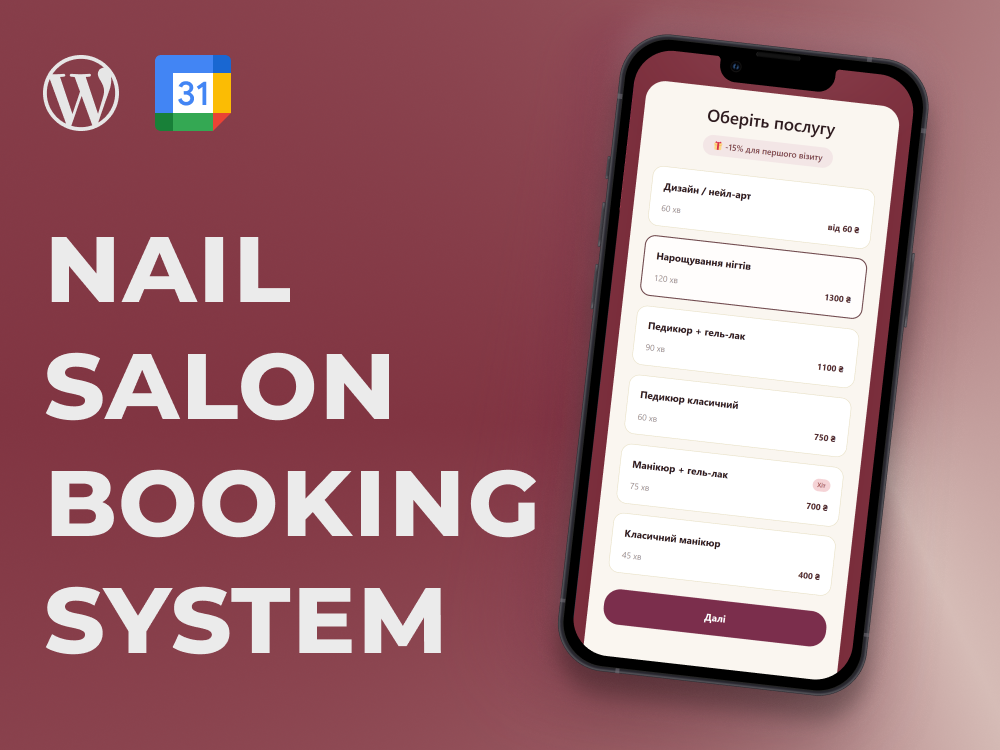

# Nail Salon Bloom

## Stack

- **CMS:** WordPress
- **Frontend:** HTML5, CSS3 (Tailwind), JavaScript (Vanilla JS).
- **Backend:** PHP.
- **Integrations:** Google Calendar API

## The Challenge

The goal of the project is to develop a lightweight, fast, and third-party subscription-independent website for booking manicures. Instead of using heavy, off-the-shelf booking plugins, the objective was to create a custom booking solution integrated into the WordPress ecosystem

## The Solution

### Plugin

I developed a standalone WordPress plugin that handles all the logic behind scheduling and booking clients.

- Flexible schedule customization: The admin panel allows you to specify working slots and set the weekly schedule. This makes it easy to mark the technician’s days off or adjust working hours.
- Step-by-Step Booking: The client follows an intuitive process: Select service → Choose available date and time → Enter contact information.

### Overbooking Protection

To prevent multiple customers from booking the same time slot, two-factor validation has been implemented:

- On the backend (MySQL): When the form is submitted, the plugin sends a query to the database to check whether the selected slot was booked by another user while the customer was filling out the form.
- On the front end (UX): If the slot is taken, JavaScript dynamically disables the form submission button (disabled), changes its visual state, and displays a warning to the user.

### Integration with the Google Calendar API

Since the project is in the MVP stage and does not yet include complex email or SMS gateways, the task of notifying the technician was solved elegantly and at no cost.

- Immediately after a successful booking on the backend, a hook is triggered that automatically creates a new event in the technician’s work calendar via the _Google Calendar API._
- The technician instantly receives a push notification on their smartphone with the booking details (customer name, phone number, selected service, and time).

## Key Takeaways

Developing this project allowed us to put a comprehensive approach to web application development into practice:

- Deep integration with the WordPress core: Instead of using off-the-shelf abstractions, the project was implemented through custom plugin development, working with the WordPress Database API, and building independent business logic in PHP.
- Data architecture design: Implementing overbooking protection and a dynamic schedule grid helped refine data validation skills at the interface between the frontend (UX validation) and backend (transactions in MySQL).
- Working with third-party ecosystems: Developing integration with the Google Calendar API allowed me to practice application authorization and working with REST APIs in a real-world asynchronous data exchange environment.
